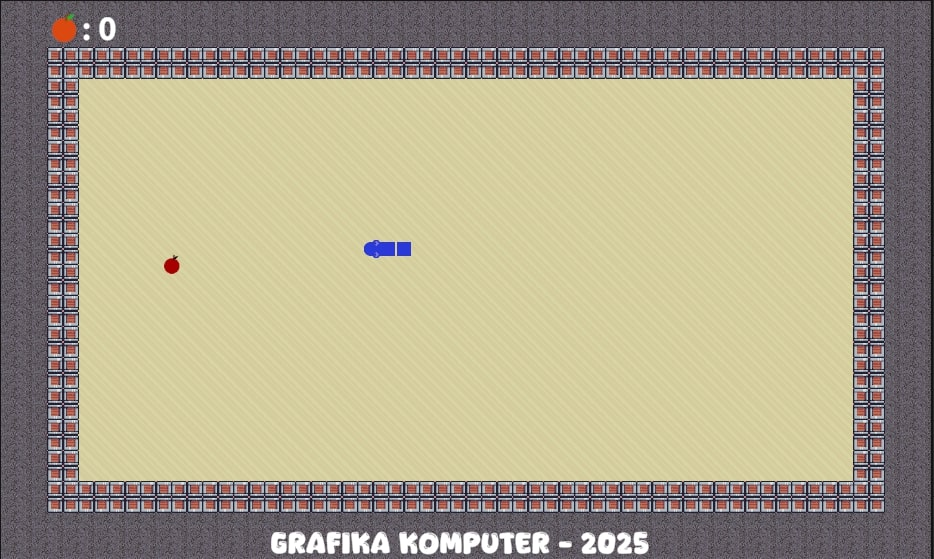
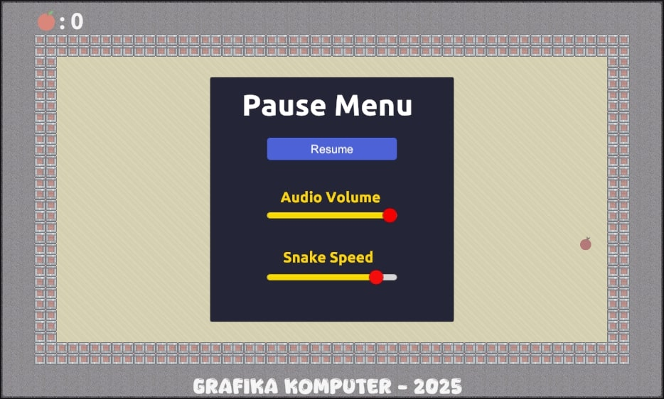

# 🐍 Snake Game – Tugas Proyek Grafika Komputer 2025





## 🧾 Informasi Umum
- **Nama:** Hidayat - 116
- **Kelas:** B
- **Mata Kuliah:** Grafika Komputer  
- **Tahun Akademik:** 2024/2025
- **Judul Proyek:** Game Snake  
- **Platform Pengembangan:** Unity  
- **Versi Unity:** 2022.3.62f1 (LTS)

## 📝 Deskripsi Proyek
Proyek ini merupakan pembuatan game **Snake** klasik sebagai bagian dari tugas mata kuliah **Grafika Komputer**. Game dikembangkan menggunakan **Unity Engine**, dengan kontrol sederhana dan sistem pertumbuhan tubuh ular saat memakan makanan.

## 🎮 Fitur Utama
- Kontrol ular dengan tombol `W`, `A`, `S`, `D` atau `tombol panah`.
- `ESC` untuk untuk Pause
- Setiap kali ular memakan makanan, tubuhnya bertambah panjang dan kecepatannya akan bertambah.
- Makanan muncul secara acak dan **tidak pernah muncul di atas tubuh ular**.
- Menggunakan **object pooling** untuk segmen tubuh ular agar efisien memori.
- Permainan akan di-reset jika ular menabrak tubuhnya sendiri atau penghalang.

## 🧱 Tools & Teknologi
- **Unity 2022.3.62f1 LTS**
- **Bahasa Pemrograman:** C#
- **Sprite Renderer** untuk menampilkan objek
- **Rigidbody2D dan Collider2D** untuk deteksi tabrakan
- **Object Pooling** untuk efisiensi performa
- **Unity Profiler** digunakan untuk memantau penggunaan memori dan performa runtime
- Serta **komponen-komponen Unity lainnya** yang terlalu banyak untuk disebut satu per satu 😄

## 🗂️ Struktur Folder Penting (Untuk Repositori Git)

Struktur berikut adalah isi folder proyek Unity yang bisa kalian **copy langsung ke folder utama** kalian saat ingin menjalankan atau mengembangkan ulang game ini:


```
Tp_Grafika_Snake_2025/
├── Assets/
│   ├── Audio/              # (Opsional) Efek suara dan musik
│   ├── Font/               # (Opsional) Font khusus untuk UI atau teks
│   ├── img/                # Gambar dokumentasi untuk README (img.png, img2.png, dll)
│   ├── Resources/          # Asset untuk Resources.Load()
│   ├── Scenes/             # Scene utama permainan (MainScene.unity, dsb)
│   ├── Scripts/            # Script utama: Snake.cs, Food.cs, GameManager.cs, dll.
│   ├── Sprites/            # Sprite ular, makanan, background, dll.
│   └── TextMesh Pro/       # File terkait TMP jika kamu pakai TMP UI
├── Packages/               # Dependency Unity (manifest.json, dsb)
├── ProjectSettings/        # Konfigurasi proyek Unity (Input, Tag, Build Settings, dll)
├── .gitignore              # File pengecualian Git, sudah disesuaikan
├── README.md               # Dokumentasi proyek, bisa menyisipkan gambar dari Assets/img/
├── Tp_Grafika_Snake_2025.sln   # Solution file untuk VSCode atau Rider
└── game_snake.sln              # (Opsional) File solusi tambahan, jika ada
```

## 🎯 Tujuan Proyek
Game ini dibuat untuk menerapkan berbagai konsep grafika komputer, seperti:
- Transformasi posisi objek dalam ruang 2D
- Deteksi tabrakan (collision detection)
- Manajemen sprite & animasi sederhana
- Randomisasi posisi objek
- Optimisasi performa dengan object pooling

## 🧠 Saran Tambahan
- Project ini bisa dikembangkan lebih lanjut dengan fitur seperti skor sistem level, dan UI game over.
- Semua aset gambar yang digunakan bersifat **gratis** dan bebas digunakan untuk keperluan pendidikan.


Terima kasih telah membaca dokumentasi ini!  
Semoga game Snake ini dapat menjadi referensi yang berguna untuk pembelajaran dan tugas lainnya.

Salam hangat,  
**Hidayat – 116**  

---

### 📚 Lisensi dan Referensi

Proyek ini disusun untuk keperluan pembelajaran dalam mata kuliah *Grafika Komputer* dan tidak ditujukan untuk penggunaan komersial.  
Seluruh kode dan aset visual/audio yang digunakan dalam proyek ini diperoleh dari sumber-sumber yang bersifat bebas pakai (*free to use*) dan telah disesuaikan secara teknis untuk memenuhi kebutuhan tugas.

Beberapa referensi dan sumber inspirasi yang digunakan dalam pengembangan proyek ini antara lain:

- **Video Tutorial:**  
  *Unity 2D Snake Game* oleh **Zigurous**, tersedia di YouTube:  
  [https://youtu.be/U8gUnpeaMbQ?si=O77rJSOSa_j2DD7b](https://youtu.be/U8gUnpeaMbQ?si=O77rJSOSa_j2DD7b)

- **Unity Asset Store:**  
  Aset grafis dan audio yang digunakan dalam proyek ini sebagian besar diperoleh dari Unity Asset Store dan digunakan secara sah sesuai dengan ketentuan lisensi gratis yang berlaku.

Penulis (**Hidayat**) melakukan modifikasi dan pengembangan lanjutan terhadap referensi tersebut, baik dari sisi struktur kode maupun tampilan visual, guna menyesuaikan dengan konteks tugas akademik serta pengembangan keterampilan pribadi.


Berikut bagian **panduan penyalinan dan pembukaan scene** yang sudah **disusun agar langsung cocok ditempel di README** kamu di bagian **setelah "Struktur Folder Penting"** dan **sebelum "Tujuan Proyek"**:

---

## 🚀 Panduan Menjalankan Proyek Unity

Agar game dapat langsung dimainkan tanpa masalah tampilan kosong (layar biru), ikuti panduan berikut:

### 📌 Langkah-langkah Menyalin Proyek

1. **Copy seluruh folder dan file** dari repositori ini, yaitu:

   * `Assets/`
   * `Packages/`
   * `ProjectSettings/`
2. **Paste-kan ke dalam folder project Unity milikmu sendiri** (project kosong yang sebelumnya sudah dibuat dengan versi Unity yang sesuai).
3. Jika muncul pop-up seperti **“Replace existing files?”**, klik **“Yes to All”** atau **“Replace All”**.

### 🧭 Cara Membuka Scene Game

Setelah proses penyalinan selesai dan project dibuka di Unity:

1. Kamu mungkin akan melihat tampilan biru kosong. Ini **normal**, karena Unity belum membuka scene utama.
2. Untuk membuka scene game:

   * Masuk ke **panel Project** (biasanya di bagian bawah).
   * Buka folder:

     ```
     Assets > Scenes > Snake (Klik Open di Pojok Kanan Atas Pada Tab Inspektor)
     ```
3. Setelah scene terbuka, tekan tombol ▶️ **Play** untuk mulai memainkan game.

### ⚠️ Catatan Penting

* **Jangan hanya meng-copy folder `Assets/` saja** — kamu harus menyertakan `Packages/` dan `ProjectSettings/` agar konfigurasi input, tag, dan build tidak hilang.