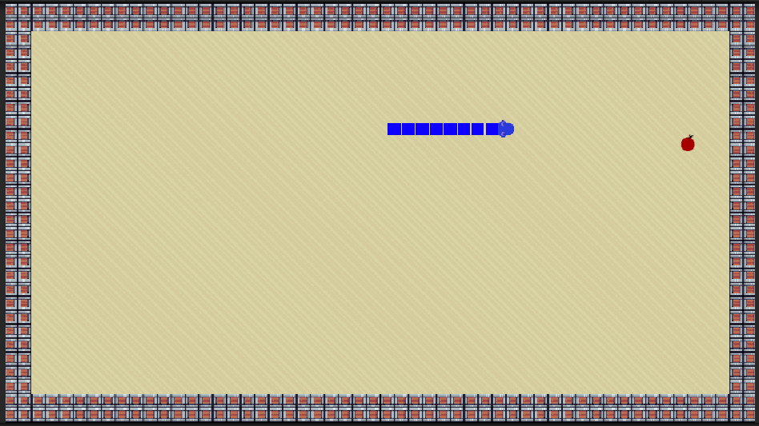

# 🐍 Snake Game – Tugas Proyek Grafika Komputer 2025



## 🧾 Informasi Umum
- **Nama:** Hidayat - 116
- **Kelas:** B
- **Mata Kuliah:** Grafika Komputer  
- **Tahun Akademik:** 2024/2025
- **Judul Proyek:** Game Snake  
- **Platform Pengembangan:** Unity  
- **Versi Unity:** 2022.3.62f1 (LTS)

## 📝 Deskripsi Proyek
Proyek ini merupakan pembuatan game **Snake** klasik sebagai bagian dari tugas mata kuliah **Grafika Komputer**. Game dikembangkan menggunakan **Unity Engine**, dengan kontrol sederhana dan sistem pertumbuhan tubuh ular saat memakan makanan.

## 🎮 Fitur Utama
- Kontrol ular dengan tombol `W`, `A`, `S`, `D` atau `tombol panah`.
- Setiap kali ular memakan makanan, tubuhnya bertambah panjang.
- Makanan muncul secara acak dan **tidak pernah muncul di atas tubuh ular**.
- Menggunakan **object pooling** untuk segmen tubuh ular agar efisien memori.
- Permainan akan di-reset jika ular menabrak tubuhnya sendiri atau penghalang.

## 🧱 Tools & Teknologi
- **Unity 2022.3.62f1 LTS**
- **Bahasa Pemrograman:** C#
- **Sprite Renderer** untuk menampilkan objek
- **Rigidbody2D dan Collider2D** untuk deteksi tabrakan
- **Object Pooling** untuk efisiensi performa
- **Unity Profiler** digunakan untuk memantau penggunaan memori dan performa runtime
- Serta **komponen-komponen Unity lainnya** yang terlalu banyak untuk disebut satu per satu 😄

## 🗂️ Struktur Folder Penting (Untuk Repositori Git)

Struktur berikut adalah isi folder proyek Unity yang bisa kalian **copy langsung ke folder utama** kalian saat ingin menjalankan atau mengembangkan ulang game ini:


```
Tp_Grafika_Snake_2025/
├── Assets/
│   ├── Audio/              # (Opsional) Efek suara dan musik
│   ├── Resources/          # (Opsional) Asset untuk Resources.Load()
│   ├── Scenes/             # Scene utama permainan
│   ├── Scripts/            # Script utama: Snake.cs, Food.cs, dll.
│   └── Sprites/            # Sprite ular, makanan, background, dll.
├── img/                    # (Opsional) Gambar untuk dokumentasi README.md
├── Packages/               # Informasi dependency Unity (wajib disertakan)
├── ProjectSettings/        # Pengaturan proyek Unity
└── README.md
```

## 🎯 Tujuan Proyek
Game ini dibuat untuk menerapkan berbagai konsep grafika komputer, seperti:
- Transformasi posisi objek dalam ruang 2D
- Deteksi tabrakan (collision detection)
- Manajemen sprite & animasi sederhana
- Randomisasi posisi objek
- Optimisasi performa dengan object pooling

## 🧠 Saran Tambahan
- Project ini bisa dikembangkan lebih lanjut dengan fitur seperti skor sistem level, dan UI game over.
- Semua aset gambar yang digunakan bersifat **gratis** dan bebas digunakan untuk keperluan pendidikan.


Terima kasih telah membaca dokumentasi ini!  
Semoga game Snake ini dapat menjadi referensi yang berguna untuk pembelajaran dan tugas lainnya.

Salam hangat,  
**Hidayat – 116**  

---

### 📚 Lisensi dan Referensi

Proyek ini disusun untuk keperluan pembelajaran dalam mata kuliah *Grafika Komputer* dan tidak ditujukan untuk penggunaan komersial.  
Seluruh kode dan aset visual/audio yang digunakan dalam proyek ini diperoleh dari sumber-sumber yang bersifat bebas pakai (*free to use*) dan telah disesuaikan secara teknis untuk memenuhi kebutuhan tugas.

Beberapa referensi dan sumber inspirasi yang digunakan dalam pengembangan proyek ini antara lain:

- **Video Tutorial:**  
  *Unity 2D Snake Game* oleh **Zigurous**, tersedia di YouTube:  
  [https://youtu.be/U8gUnpeaMbQ?si=O77rJSOSa_j2DD7b](https://youtu.be/U8gUnpeaMbQ?si=O77rJSOSa_j2DD7b)

- **Unity Asset Store:**  
  Aset grafis dan audio yang digunakan dalam proyek ini sebagian besar diperoleh dari Unity Asset Store dan digunakan secara sah sesuai dengan ketentuan lisensi gratis yang berlaku.

Penulis (**Hidayat**) melakukan modifikasi dan pengembangan lanjutan terhadap referensi tersebut, baik dari sisi struktur kode maupun tampilan visual, guna menyesuaikan dengan konteks tugas akademik serta pengembangan keterampilan pribadi.

